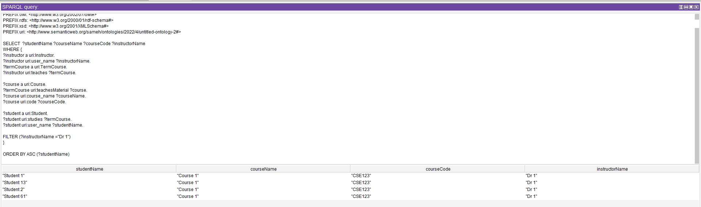

# Queries

## Table of Content

- [2nd Highest CGPA](#2nd-highest-cgpa)
  - [Query](#query)
  - [Output](#output)
- [Average CGPA of students taking each training](#average-cgpa-of-students-taking-each-training)
  - [Query](#query-1)
  - [Output](#output-1)
- [Students and their courses and the instructors of the their courses](#students-and-their-courses-and-the-instructors-of-the-their-courses)
  - [Query](#query-2)
  - [Output](#output-2)
- [Students of courses taught by the instructor with the name 'Dr 1'](#students-of-courses-taught-by-the-instructor-with-the-name-dr-1)
  - [Query](#query-3)
  - [Output](#output-3)
- [Same as previous but only courses that start with 'CSE'](#same-as-previous-but-only-courses-that-start-with-cse)
  - [Query](#query-4)
  - [Output](#output-4)
- [The previous two queries together](#the-previous-two-queries-together)
  - [Query](#query-5)
  - [Output](#output-5)
- [Students With CGPA Lower than 2](#students-with-cgpa-lower-than-2)
  - [Query](#query-6)
  - [Output](#output-6)
- [Training](#training)
  - [Query](#query-7)
  - [Output](#output-7)
- [Student Names and their Advisor Names](#student-names-and-their-advisor-names)
  - [Query](#query-8)
  - [Output](#output-8)

## 2nd Highest CGPA

### Query

```sql
PREFIX rdf: <http://www.w3.org/1999/02/22-rdf-syntax-ns#>
PREFIX owl: <http://www.w3.org/2002/07/owl#>
PREFIX rdfs: <http://www.w3.org/2000/01/rdf-schema#>
PREFIX xsd: <http://www.w3.org/2001/XMLSchema#>
PREFIX uri: <http://www.semanticweb.org/sameh/ontologies/2022/4/untitled-ontology-2#>

SELECT  ?studentName ?cgpa
WHERE {
?student a uri:Student.
?student uri:cgpa ?cgpa.
?student uri:user_name ?studentName.
}
ORDER BY DESC (?cgpa)
LIMIT 1
OFFSET 1

```

### Output


## Average CGPA of students taking each training

### Query

```sql
PREFIX rdf: <http://www.w3.org/1999/02/22-rdf-syntax-ns#>
PREFIX owl: <http://www.w3.org/2002/07/owl#>
PREFIX rdfs: <http://www.w3.org/2000/01/rdf-schema#>
PREFIX xsd: <http://www.w3.org/2001/XMLSchema#>
PREFIX uri: <http://www.semanticweb.org/sameh/ontologies/2022/4/untitled-ontology-2#>

 SELECT (AVG(?cgpa) AS ?avgCgpa) ?training
 WHERE {
?student a uri:Student.
?student uri:cgpa ?cgpa.
?training a uri:Training.
?student uri:takes ?training
}
 GROUP BY ?training
```

### Output


## Students and their courses and the instructors of the their courses

### Query

```sql
PREFIX rdf: <http://www.w3.org/1999/02/22-rdf-syntax-ns#>
PREFIX owl: <http://www.w3.org/2002/07/owl#>
PREFIX rdfs: <http://www.w3.org/2000/01/rdf-schema#>
PREFIX xsd: <http://www.w3.org/2001/XMLSchema#>
PREFIX uri: <http://www.semanticweb.org/sameh/ontologies/2022/4/untitled-ontology-2#>

SELECT  ?studentName ?courseName ?courseCode ?instructorName
WHERE {
?instructor a uri:Instructor.
?instructor uri:user_name ?instructorName.
?termCourse a uri:TermCourse.
?instructor uri:teaches ?termCourse.

?course a uri:Course.
?termCourse uri:teachesMaterial ?course.
?course uri:course_name ?courseName.
?course uri:code ?courseCode.

?student a uri:Student.
?student uri:studies ?termCourse.
?student uri:user_name ?studentName
}

ORDER BY ASC (?studentName)
```

### Output


## Students of courses taught by the instructor with the name 'Dr 1'

### Query

```sql
PREFIX rdf: <http://www.w3.org/1999/02/22-rdf-syntax-ns#>
PREFIX owl: <http://www.w3.org/2002/07/owl#>
PREFIX rdfs: <http://www.w3.org/2000/01/rdf-schema#>
PREFIX xsd: <http://www.w3.org/2001/XMLSchema#>
PREFIX uri: <http://www.semanticweb.org/sameh/ontologies/2022/4/untitled-ontology-2#>

SELECT  ?studentName ?courseName ?courseCode ?instructorName
WHERE {
?instructor a uri:Instructor.
?instructor uri:user_name ?instructorName.
?termCourse a uri:TermCourse.
?instructor uri:teaches ?termCourse.

?course a uri:Course.
?termCourse uri:teachesMaterial ?course.
?course uri:course_name ?courseName.
?course uri:code ?courseCode.

?student a uri:Student.
?student uri:studies ?termCourse.
?student uri:user_name ?studentName.

FILTER (?instructorName ="Dr 1")
}

ORDER BY ASC (?studentName)
```

### Output



## Same as previous but only courses that start with 'CSE'

### Query

```sql
PREFIX rdf: <http://www.w3.org/1999/02/22-rdf-syntax-ns#>
PREFIX owl: <http://www.w3.org/2002/07/owl#>
PREFIX rdfs: <http://www.w3.org/2000/01/rdf-schema#>
PREFIX xsd: <http://www.w3.org/2001/XMLSchema#>
PREFIX uri: <http://www.semanticweb.org/sameh/ontologies/2022/4/untitled-ontology-2#>

SELECT  ?studentName ?courseName ?courseCode ?instructorName
WHERE {
?instructor a uri:Instructor.
?instructor uri:user_name ?instructorName.
?termCourse a uri:TermCourse.
?instructor uri:teaches ?termCourse.

?course a uri:Course.
?termCourse uri:teachesMaterial ?course.
?course uri:course_name ?courseName.
?course uri:code ?courseCode.

?student a uri:Student.
?student uri:studies ?termCourse.
?student uri:user_name ?studentName.

FILTER (REGEX(?courseCode, "CSE.*")).
}

ORDER BY ASC (?studentName)
```

### Output


## The previous two queries together

### Query

```sql
PREFIX rdf: <http://www.w3.org/1999/02/22-rdf-syntax-ns#>
PREFIX owl: <http://www.w3.org/2002/07/owl#>
PREFIX rdfs: <http://www.w3.org/2000/01/rdf-schema#>
PREFIX xsd: <http://www.w3.org/2001/XMLSchema#>
PREFIX uri: <http://www.semanticweb.org/sameh/ontologies/2022/4/untitled-ontology-2#>

SELECT  ?studentName ?courseName ?courseCode ?instructorName
WHERE {
?instructor a uri:Instructor.
?instructor uri:user_name ?instructorName.
?termCourse a uri:TermCourse.
?instructor uri:teaches ?termCourse.

?course a uri:Course.
?termCourse uri:teachesMaterial ?course.
?course uri:course_name ?courseName.
?course uri:code ?courseCode.

?student a uri:Student.
?student uri:studies ?termCourse.
?student uri:user_name ?studentName.

FILTER (REGEX(?courseCode, "CSE.*") && ?instructorName = "Dr 2").
}

ORDER BY ASC (?studentName)
```

### Output


## Students With CGPA Lower than 2

### Query

```sql
PREFIX rdf: <http://www.w3.org/1999/02/22-rdf-syntax-ns#>
PREFIX owl: <http://www.w3.org/2002/07/owl#>
PREFIX rdfs: <http://www.w3.org/2000/01/rdf-schema#>
PREFIX xsd: <http://www.w3.org/2001/XMLSchema#>
PREFIX uri: <http://www.semanticweb.org/sameh/ontologies/2022/4/untitled-ontology-2#>

SELECT ?student ?cgpa
WHERE {
?student a uri:Student.
?student uri:cgpa ?cgpa.
FILTER (?cgpa <2).
}
ORDER BY ASC (?cgpa)
```

### Output


## Training

### Query

```sql
PREFIX rdf: <http://www.w3.org/1999/02/22-rdf-syntax-ns#>
PREFIX owl: <http://www.w3.org/2002/07/owl#>
PREFIX rdfs: <http://www.w3.org/2000/01/rdf-schema#>
PREFIX xsd: <http://www.w3.org/2001/XMLSchema#>
PREFIX uri: <http://www.semanticweb.org/sameh/ontologies/2022/4/untitled-ontology-2#>

SELECT  ?studentName ?training ?trainingStartDate ?trainingEndDate
WHERE {
?student a uri:Student.
?student uri:user_name ?studentName.

?training a uri:Training.
?student uri:takes ?training .

?training uri:start_date ?trainingStartDate.
?training uri:end_date ?trainingEndDate.
}
```

### Output


## Student Names and their Advisor Names

### Query

```sql
PREFIX rdf: <http://www.w3.org/1999/02/22-rdf-syntax-ns#>
PREFIX owl: <http://www.w3.org/2002/07/owl#>
PREFIX rdfs: <http://www.w3.org/2000/01/rdf-schema#>
PREFIX xsd: <http://www.w3.org/2001/XMLSchema#>
PREFIX uri: <http://www.semanticweb.org/sameh/ontologies/2022/4/untitled-ontology-2#>

SELECT ?studentName ?instructorName
WHERE {
?student a uri:Student.
?instructor a uri:Instructor.
?instructor uri:advises ?student.
?student uri:user_name ?studentName.
?instructor uri:user_name ?instructorName
}
```

### Output


